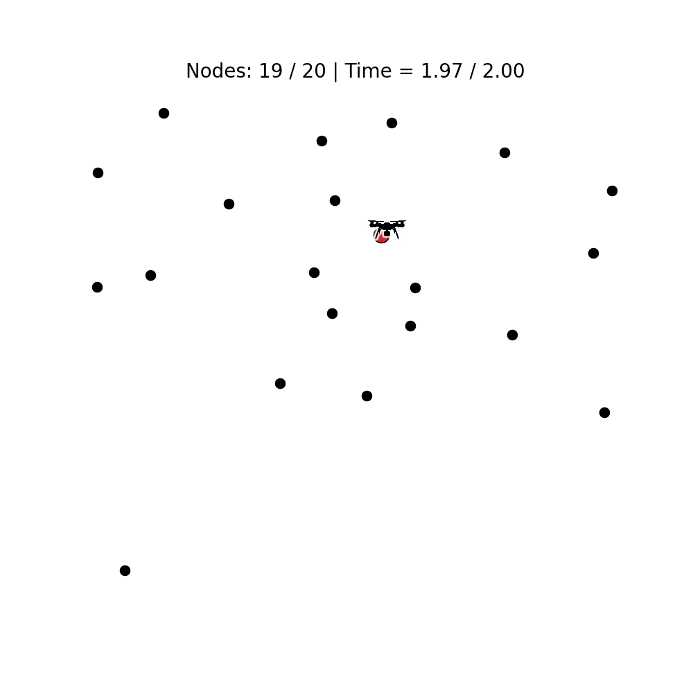

# Solving the Team Orienteering Problem with Transformers



## Paper
Solve a variant of the Orieentering Problem (OP) called the Team Orienteering Problem (TOP) with a cooperative
multi-agent system based on Transformer Networks. For more details, please see our [paper](). If this repository is
useful for your work, please cite our paper:

```

``` 

## Dependencies

* Python >= 3.8
* NumPy
* SciPy
* Numba
* [PyTorch](http://pytorch.org/) >= 1.7
* tqdm
* [tensorboard_logger](https://github.com/TeamHG-Memex/tensorboard_logger)
* Matplotlib

## Usage

First, it is necessary to create test and validation sets:
```bash
python generate_data.py --name test --seed 1234 --graph_sizes 20 50 100 --max_length 2
python generate_data.py --name val --seed 4321 --graph_sizes 20 50 100 --max_length 2
```

To train a Transformer model (`attention`) use:
```bash
python run.py --model attention --graph_size 20 --max_length 2 --num_agents 2 --data_distribution const --baseline rollout --val_dataset data/1depots/const/20/validation_seed4321_L2.pkl
```

[Pointer Network](https://arxiv.org/abs/1506.03134) (`pointer`),
[Graph Pointer Network](https://arxiv.org/abs/1911.04936) (`gpn`) and
[GAMMA](https://doi.org/10.1109/TNNLS.2022.3159671)
(`gamma`) can also be trained with the `--model` option. To resume training, load your last saved model with the
`--resume` option. Additionally, pretrained models are provided inside the folder `pretrained`.

Evaluate your trained models with:
```bash
python eval.py --model outputs/top_const20/attention_run... --num_agents 2 --datasets data/1depots/const/20/test_seed1234_L2.pkl
```
If the epoch is not specified, by default the last one in the folder will be used.

Baselines algorithms like Ant Colony Optimization (`aco`), Particle Swarm Optimization (`pso`), or Genetic Algorithm
(`opga`) can be executed as follows:
```bash
python -m problems.op.eval_baselines --method aco --multiprocessing True --datasets data/1depots/const/20/test_seed1234_L2.pkl
```

Finally, you can visualize an example using:
```bash
python visualize.py --graph_size 20 --num_agents 2 --max_length 2--data_distribution const --model outputs/op_const20/attention_run...
python visualize.py --graph_size 20 --num_agents 2 --max_length 2--data_distribution const --model aco
```

### Other options and help
```bash
python run.py -h
python eval.py -h
python -m problems.op.eval_baselines -h
python visualize.py -h
```

## Acknowledgements
This repository is an adaptation of
[wouterkool/attention-learn-to-route](https://github.com/wouterkool/attention-learn-to-route) for the TOP. The baseline
algorithms (ACO, PSO, and GA) were implemented following the next repositories:
[robin-shaun/Multi-UAV-Task-Assignment-Benchmark](https://github.com/robin-shaun/Multi-UAV-Task-Assignment-Benchmark)
and [dietmarwo/Multi-UAV-Task-Assignment-Benchmark](https://github.com/dietmarwo/Multi-UAV-Task-Assignment-Benchmark)
